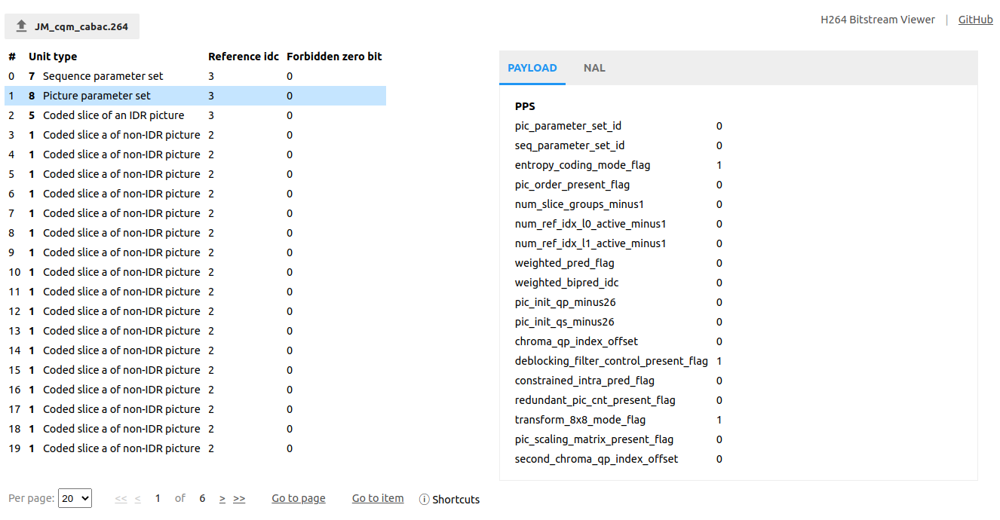

# h264-bitstream-viewer 

> Web UI on top of [h264bitstream][h264bitstream], inspired by [H264Naked][h264naked], to display information about NAL units of H264 bitstream.

### [Web application available here][web]

## Documentation

- [Development](./docs/development.md)
- [H264](./docs/h264.md)
- [TODO](./docs/todo.md)

[h264bitstream]: https://github.com/aizvorski/h264bitstream
[h264naked]: https://github.com/shi-yan/H264Naked
[web]: https://mradionov.github.io/h264-bitstream-viewer/

## License

[MIT](LICENSE)
